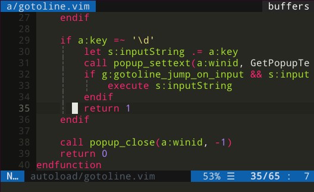

# 'Go to line' popup
Almost same as `100G` in normal mode, but with convenience


### Installation
```
Plug 'axlebedev/vim-gotoline-popup'
nmap <C-g> <plug>(gotoline-popup)
```

### Usage
Press `<C-g>` to open popup.  
Enter line number, press `Enter` to jump to line  
Press `Esc` or any not number to cancel and close popup.

## Params
Change input prompt  
`let g:gotoline_prompt = "Go to line: "`

Go to inputed line immediately  
`let g:gotoline_jump_on_input = 1`

Return to initial line if popup was cancelled  
`let g:gotoline_reset_on_cancel = 1`
